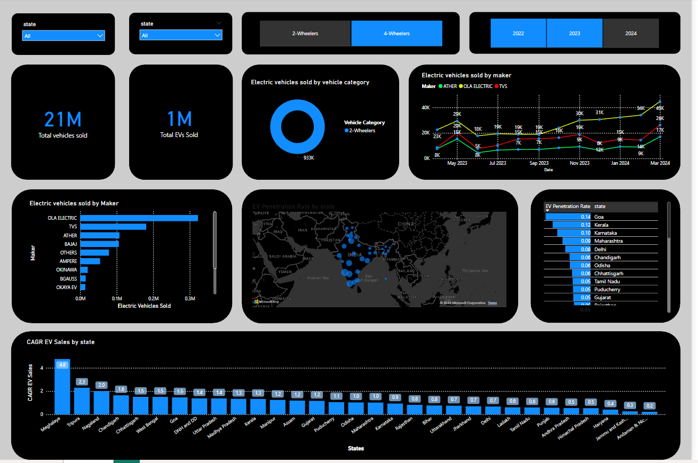

# Electric Vehicle Sales Analysis Dashboard

This repository contains a Power BI dashboard designed to visualize electric vehicle sales data, offering insights into the performance of various electric vehicle manufacturers and overall sales trends across different states in India.

## Table of Contents
- [Overview](#overview)
- [Features](#features)
- [How It Works](#how-it-works)
- [Tech Stack](#tech-stack)
- [Installation](#installation)
- [Usage](#usage)
- [Dashboard Overview](#dashboard-overview)
- [Data Structure](#data-structure)
- [Testing with Power BI](#testing-with-power-bi)
- [Contributing](#contributing)
- [License](#license)

## Overview

This dashboard is designed to help stakeholders understand the electric vehicle market in India by providing visual representations of sales data. It enables users to analyze the performance of different electric vehicle manufacturers and track trends over time.

### Significance of Electric Vehicles in India
Electric vehicles are pivotal in India's transition towards sustainable transport. Understanding sales trends helps manufacturers and policymakers make informed decisions.

## Features
- **Interactive Visualizations**: Engaging charts and graphs to visualize electric vehicle sales data.
- **Performance Insights**: Key performance metrics such as CAGR, EV penetration rate, and total EV sales by vehicle category and state.
- **User-Friendly Interface**: Intuitive design for easy navigation and exploration of the data.
- **Dynamic Filters**: Ability to filter data by state and vehicle category for targeted insights.

## How It Works
1. The dashboard connects to datasets that contain electric vehicle sales information.
2. Data is transformed and modeled to create meaningful visualizations.
3. Users can interact with the dashboard to explore different aspects of the sales data.
4. Insights are generated based on the selected filters and visualizations.

## Tech Stack
- **Data Visualization**: Power BI
- **Data Sources**: Excel, CSV, or database files containing electric vehicle sales data.
- **Data Processing**: Power Query for data transformation and DAX for calculations.

## Installation

To set up the Power BI dashboard locally, follow these steps:

1. Clone the repository:
    ```bash
    git clone https://github.com/Nikhil-Pawar11/electric-vehicle-sales-dashboard.git
    cd electric-vehicle-sales-dashboard
    ```

2. Ensure you have Power BI Desktop installed. You can download it from [Microsoft Power BI](https://powerbi.microsoft.com/desktop/).

3. Open the `.pbix` file located in the repository to view and interact with the dashboard.

## Usage

Once the Power BI dashboard is open, you can explore the visualizations and metrics provided. Use the filters to adjust the data displayed based on specific criteria such as state or vehicle category.

## Dashboard Overview
The Power BI dashboard provides an interactive visual representation of electric vehicle sales data, facilitating insights into market trends and performance across various states and vehicle categories. Below is a description of each dashboard element:

1. **Total EV Sales by State**:
   - **Description**: This visual displays the total number of electric vehicles sold in each state. It helps identify states with the highest and lowest sales performance, providing insights for targeted marketing and sales strategies.
   - **Visualization Type**: Bar Chart

2. **CAGR EV Sales**:
   - **Description**: This measure calculates the Compound Annual Growth Rate (CAGR) of electric vehicle sales across various states over a specified period, providing insights into growth trends and helping to evaluate the overall performance of the electric vehicle market.
   - **Visualization Type**: Clustered Column Chart

3. **EV Penetration Rate**:
   - **Description**: This visual indicates the penetration rate of electric vehicles compared to total vehicle sales in each state. It shows how well electric vehicles are being adopted relative to traditional vehicles.
   - **Visualization Type**: Map, Table

4. **Total EV Sales by Vehicle Category**:
   - **Description**: This visual breaks down electric vehicle sales into different categories (e.g., two-wheelers and four-wheelers), allowing for a detailed comparison of sales performance across vehicle types.
   - **Visualization Type**: Donut Chart

5. **Total Vehicles Sold**:
   - **Description**: This measure shows the total number of vehicles sold (both electric and non-electric) across all states. It provides context for understanding the overall market landscape and the share of electric vehicles.
   - **Visualization Type**: Card Visual

## Dashboard Screenshot

Here is a screenshot of the Power BI dashboard:

<p align="center">
    
</p>

This screenshot illustrates the main features of the dashboard, showcasing various visualizations of electric vehicle sales data.

## Dashboard Demo Video
To see the Power BI dashboard in action, please watch the video below:

[Watch the Dashboard Demo](videos/dashboard_walkthrough.mp4)

## Data Structure
The data used in the dashboard consists of the following fields:

- **State**: The state in which the electric vehicles were sold.
- **Maker**: The manufacturer of the electric vehicle.
- **Vehicle Category**: The category of the vehicle (e.g., 2W, 4W).
- **Total Sales**: The total number of electric vehicles sold.
- **Sales Year**: The year in which the sales occurred.
- **Total EV Sales**: The cumulative sales figures of electric vehicles for each category.

## Measures
The following measures have been created for the Power BI dashboard:

1. **CAGR EV Sales**: Calculates the compound annual growth rate of electric vehicle sales over a specified period.
   - **Formula**: 
     ```DAX
         CAGR EV Sales = 
         VAR StartYearEVs = 
            CALCULATE(
                SUM(electrical_vehicles_sales_by_state[electric_vehicles_sold]),
                'dim_date'[fiscal_year] = 2022
            )
         VAR EndYearEVs = 
            CALCULATE(
                SUM(electrical_vehicles_sales_by_state[electric_vehicles_sold]),
                'dim_date'[fiscal_year] = 2024
            )
         RETURN
         IF(
            ISBLANK(StartYearEVs) || StartYearEVs = 0,
            BLANK(),
            POWER(EndYearEVs / StartYearEVs, 1 / 2) - 1
         )
     ```
   - **Description**: This measure calculates the growth rate of electric vehicle sales from 2022 to 2024.

2. **EV Penetration Rate**: Measures the percentage of electric vehicles sold compared to total vehicle sales.
   - **Formula**: 
     ```DAX
         Penetration Rate = 
         VAR SelectedCategory = 
            SELECTEDVALUE(electrical_vehicles_sales_by_state[vehicle_category])
         VAR TotalElectric = 
            SUMX(
                FILTER(
                    electrical_vehicles_sales_by_state,
                    electrical_vehicles_sales_by_state[vehicle_category] = SelectedCategory
                ),
                electrical_vehicles_sales_by_state[electric_vehicles_sold]
            )
         VAR TotalVehicles = 
            SUMX(
                FILTER(
                    electrical_vehicles_sales_by_state,
                    electrical_vehicles_sales_by_state[vehicle_category] = SelectedCategory
                ),
                electrical_vehicles_sales_by_state[total_vehicles_sold] -- Assuming this column exists
            )
         RETURN
         DIVIDE(TotalElectric, TotalVehicles, 0)
     ```
   - **Description**: This measure calculates the percentage of electric vehicles sold compared to total vehicle sales for the selected category.

3. **Total EV Sales by Vehicle Category**: Displays total sales figures for electric vehicles categorized by 2W and 4W.
   - **Formula**: 
     ```DAX
         Total EV Sales by Vehicle Category = 
         CALCULATE(
             SUM(electrical_vehicles_sales_by_state[electric_vehicles_sold]),
             'electrical_vehicles_sales_by_state'[vehicle_category]
         )
     ```
   - **Description**: This measure sums the electric vehicle sales based on the category (2W or 4W).

4. **Total EV Sales by State**: Shows total electric vehicle sales aggregated by state.
   - **Formula**: 
     ```DAX
         Total EV Sales by State = 
         CALCULATE(
             SUM(electrical_vehicles_sales_by_state[electric_vehicles_sold]),
             ALLEXCEPT(electrical_vehicles_sales_by_state, electrical_vehicles_sales_by_state[state])
         )
     ```
   - **Description**: This measure calculates the total electric vehicle sales for each state, helping to visualize sales performance geographically.

5. **Total Vehicles Sold**: Summarizes total vehicle sales across all categories and states.
   - **Formula**: 
     ```DAX
         Total Vehicles Sold = 
         SUM(electrical_vehicles_sales_by_state[total_vehicles_sold]) -- Assuming this column exists
     ```
   - **Description**: This measure aggregates the total sales figures for all vehicles sold.

## Testing with Power BI

To test the dashboard, ensure you have the necessary datasets imported and follow these steps:

1. Open the Power BI dashboard and check the visualizations.
2. Experiment with the filters available in the dashboard to gain different insights.
3. Explore the interactions between various visuals to understand how they relate to each other.
4. Review the measures in the data model to understand how calculations are derived.

## Contributing

If you would like to contribute to this project, please fork the repository and submit a pull request. Any feedback, suggestions, or improvements are welcome!

## License

This project is licensed under the MIT License - see the [LICENSE](LICENSE) file for details.
